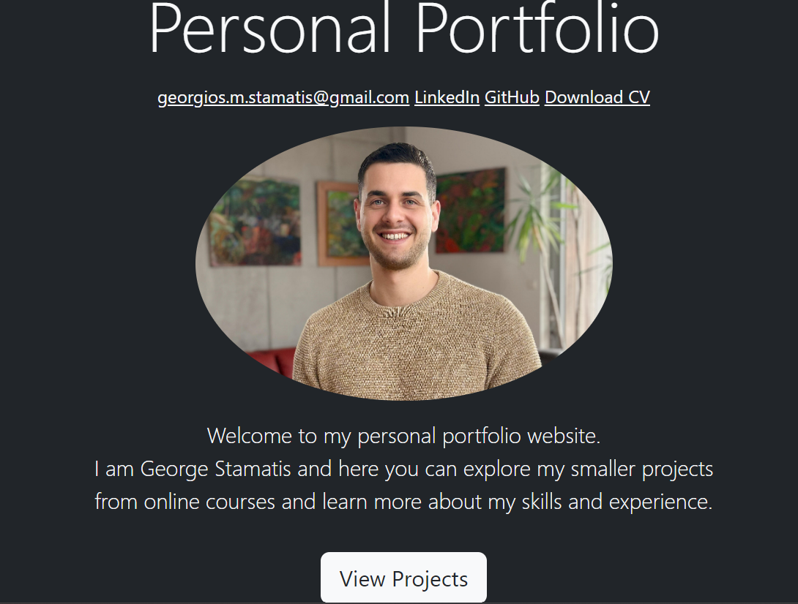

# Personal Portfolio Website with Django

## Description

This project is a personal portfolio website developed using Django. It showcases my smaller scale projects acquired from online courses. The website is containerized with Docker for easy deployment and management. It also includes an admin page for content management.

## Technologies Used

- Django
- Python
- HTML
- Bootstrap
- Docker

## Features

- Showcase personal projects
- Containerized with Docker
- Admin page for content management

## Screenshots

